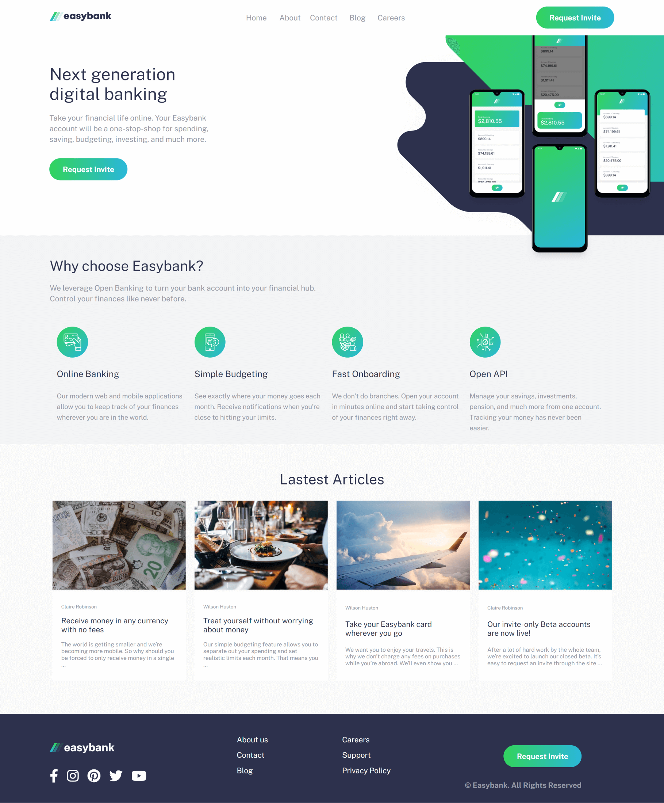

# Frontend Mentor - Easybank landing page solution

## Table of contents

- [Overview](#overview)
  - [The challenge](#the-challenge)
  - [Screenshot](#screenshot)
  - [Links](#links)
- [My process](#my-process)
  - [Built with](#built-with)
  - [What I learned](#what-i-learned)
  - [Continued development](#continued-development)
- [Author](#author)

## Overview

### The challenge

Users should be able to:

- View the optimal layout for the site depending on their device's screen size
- See hover states for all interactive elements on the page

### Screenshot

### Links

- Solution URL: [https://github.com/anfer-code/easybank](https://github.com/anfer-code/easybank)
- Live Site URL: [https://anfer-code.github.io/easybank/index.html](https://anfer-code.github.io/easybank/index.html)

## My process

### Built with

- Semantic HTML5 markup
- PUG
- SASS
- Flexbox
- Mobile-first workflow

### What I learned

This time I worked with prepros: SASS and PUG, it was a challenge but I am proud of the result.

### Continued development

Next time I hope to work with API or practice again with SASS

## Author

- Frontend Mentor - [@anfer-code](https://www.frontendmentor.io/profile/anfer-code)
- Twitter - [@ValeraAnfer](https://twitter.com/ValeraAnfer)
